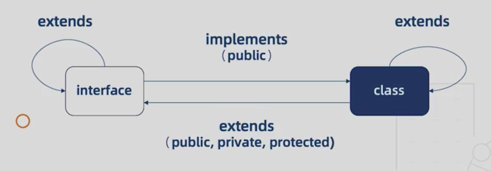

# 类与接口的关系

## 类实现接口

使用implements关键字表示一个类实现了某个接口。类实现接口，必须实现其中的所有成员，包括属性和方法。以下三点注意：

- 必须实现所有接口声明的属性
- 接口只能约束类的公有成员
- 接口不能约束类的构造函数

## 接口继承接口

接口的继承可以抽离出可重用的接口，也可以将多个接口合并为一个接口。接口继承使用 extends 关键字继承，可以同时继承多个接口，用逗号分开，这一特性使得可以将多个接口的定义合并为一个新的接口定义。接口继承这一特性本身也让接口定义得以被复用。

## 接口继承类

只有成员结构，没有实现。需要注意的一点是：<u>接口继承类的时候不仅继承了public成员，也继承了private和protected成员</u>


## 接口与类的相关关系图


# 泛型
如何让一个函数或者一个类支持多种类型的数据，但又无需重新为新的类型再写一遍代码？
在函数中你可以用函数重载，但是写起来太冗长。你也可以使用any，但那样就会丢失类型信息，而类型是整个Typescript的一个关键，于是有了泛型。

> 泛型： 不预先确定数据类型，具体的类型在使用的时候才确定

这种不预先确定类型，在具体使用时候再确定的声明方式。实际上<u>相当于在声明的时候，将类型这一特性当做了一个变量，用了一个替代符号先用来占位，在使用的时候，把类型传入。</u>

## 泛型函数
将泛型引入到函数上，让函数可以根据使用时传入的类型来具体运行。

## 泛型类型
除了放到函数声明上，泛型也可以放到函数类型的定义上，比如：
```typescript
type Log = <T>(value: T) => T
```

## 泛型接口
可以将泛型应用到接口的方法成员上，也可以直接将泛型应用于整个接口，这时候整个接口中都可以使用这个泛型类型。

## 泛型类
需要注意的一点是：<u>类有静态部分和实例部分，泛型类指的是实例部分的类型，静态部分是不能使用的。</u>

这一点其实容易想明白，既然泛型是需要在使用的时候才能确定的类型，那么静态部分这种固定的内容自然是没法去动态指定类型的。

## 泛型约束

```typescript
interface Length {
  length: number;
}
function print<T extends Length>(value: T) {
  console.log(value, value.length);
}
```
泛型约束，泛型我们已经清楚，重点在**约束**二字。

泛型约束用extends关键字来约束一个泛型变量，使得你传入的值必须是满足给定接口的约束条件，也就是说该有的属性都得有，才能正确被使用。有了泛型约束，传入的值的类型就不能是随便什么类型了，你受限了。


## 小结
泛型的好处：
1. 函数和类可以轻松支持多种类型，程序更易扩展
2. 不需要写很多函数重载和冗长的联合类型的声明，代码可读性增强
3. 灵活控制类型之间的约束