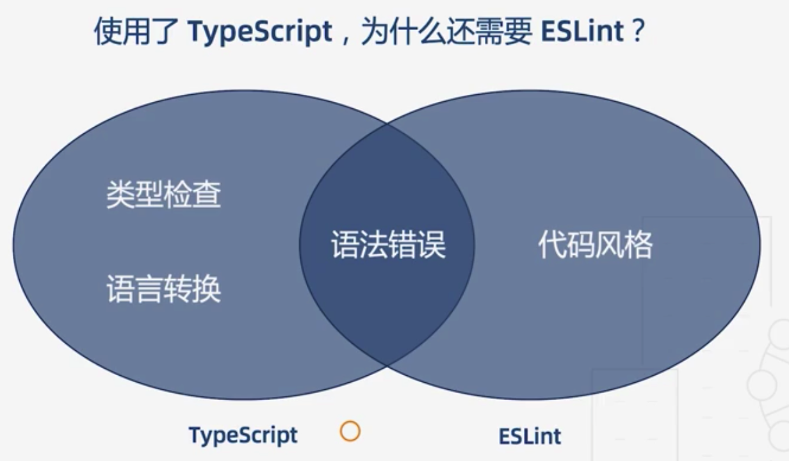

# 从 TSLint 到 ESLint

Typescript 官方转向 ESLint 的原因：

1. TSLint 执行规则的方式存在一些架构问题，从而影响了性能，而修复这些问题会破坏现有的规则
2. ESLint 的性能更好，并且社区用户通常拥有 ESLint 的规则配置，而不会拥有 TSLint 的规则配置

可以使用官方背书的 `typscript-eslint` 包来做 lint 检查。好处在于它是基于 Typescript 的 AST，支持创建基于类型信息的规则（tsconfig.json）

# 使用 jest 进行单元测试

jest 是一款优秀的测试框架，使用 jest 进行测试，也有 TS 系的工具和 Babel 系的工具。

[参见项目代码](./demos/ts-jest/)
